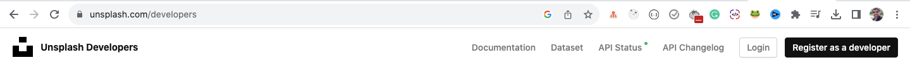
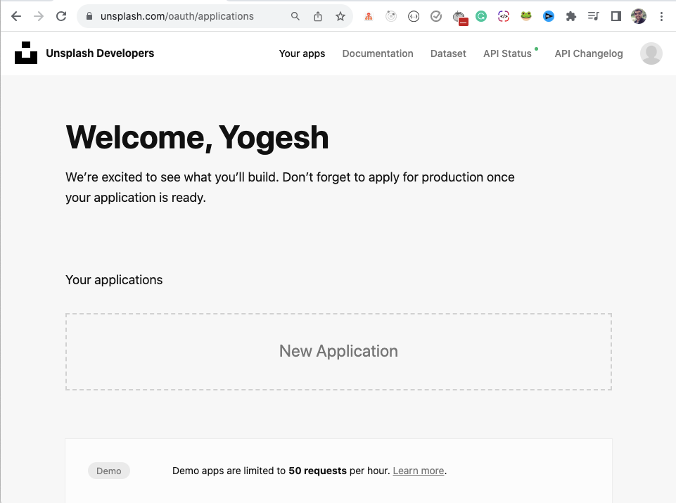
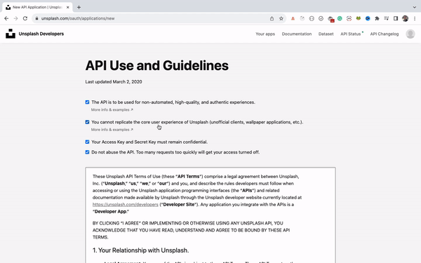

# 02. Images search

Este experimento es buscador de imágenes en Unsplash creado con React.js, react-bootstrap y axios.

Para correrlo descarga el proyecto y ejecuta

`npm i`

Una vez que se hayan instalado las dependencias deberás crear un archivo .env para guardar tu API_KEY de Unsplash.

Finalmente ejecuta

`npm run dev`

## Cómo obtener el API key de Unsplash

Vé a [https://unsplash.com/developers](https://unsplash.com/developers) y haz click en el botón **Register as a developer** arriba a la derecha de la página.

Una vez que te hayas registrado, serás redirigido a esta página

Haz click en el botón **New Application**.
En la siguiente página deberás marcar todos los checkbox y clickear **Accept terms**.
Ingresa el Nombre de la aplicación y una descripción y finalmente click en el botón **Create application**.

Si bajas un poco en la siguiente página encontrarás el **Access Key**. Crea un archivo .env en el root del proyecto y dentro escribe una contante VITE_API_KEY con el valor del **Access Key** de Unsplash.

`VITE_API_KEY={access_key_unsplash}`

Asegúrate de que la constante comience con VITE_ para que sea accesible en toda la aplicación.

---

Créditos: [How to Build an Image Search App Using React](https://www.freecodecamp.org/news/how-to-build-an-image-search-app-using-react/) de [@myogeshchavan97](https://github.com/myogeshchavan97)